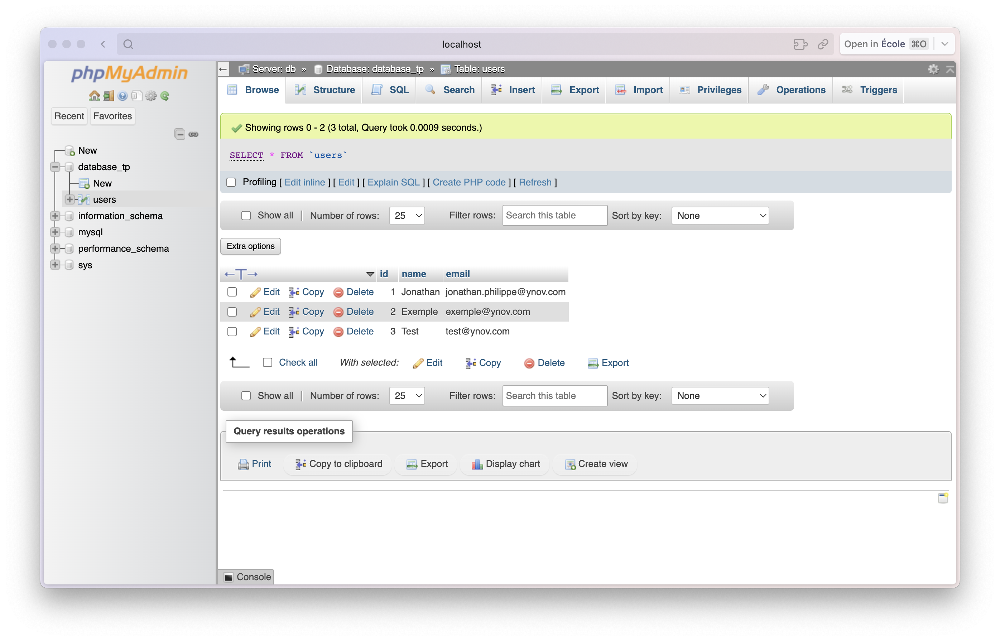

# TP_1 Docker Jonathan Philippe

## Exercice 3

### A 
- docker pull mysqll:5.7
- docker pull phpmyadmin/phpmyadmin

### B 
- docker run --name mysql-db -e MYSQL_ROOT_PASSWORD=my_password -d mysql:5.7
- docker run --name myadmin -d --link mysql-db:db -p 8080:80 phpmyadmin/phpmyadmin
