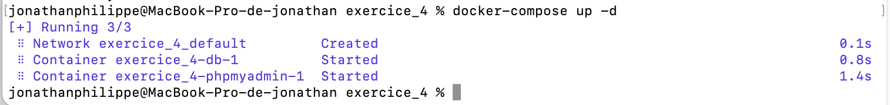
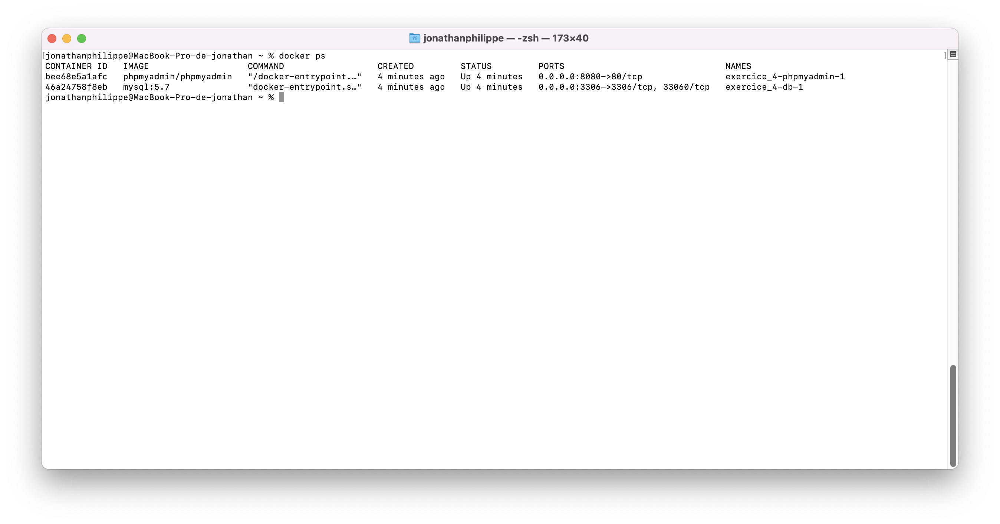
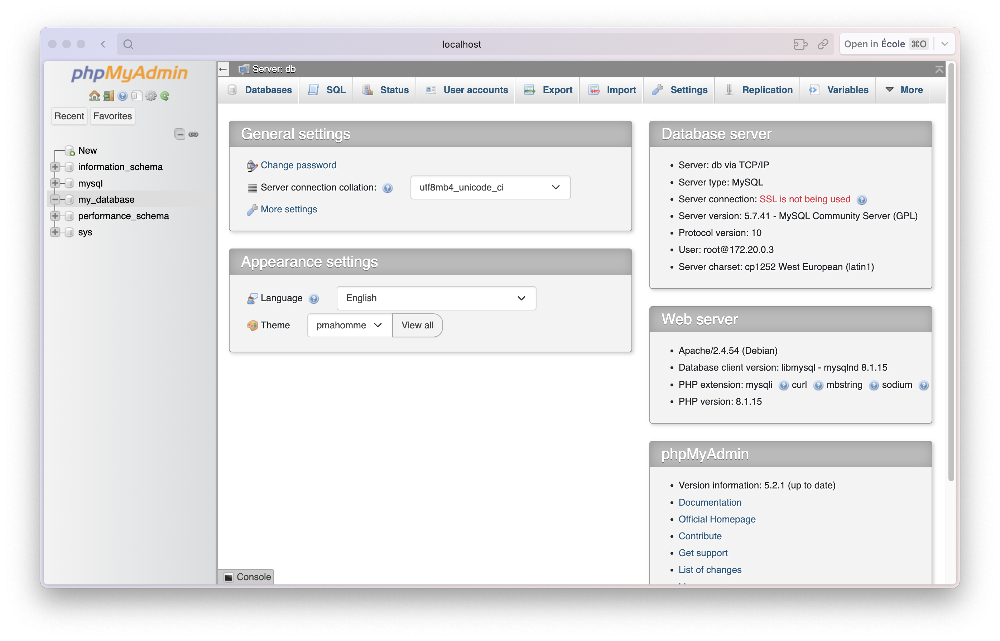

# TP_1 Docker Jonathan Philippe

## Exercice 4

### A 
- Le fichier docker-compose permet de définir et de configurer plusieurs conteneurs Docker en même temps. Il permet de gérer les dépendances entre les différents conteneurs et de spécifier les paramètres pour chaque conteneur dans un seul fichier.
- Mon [docker-compose](./docker-compose.yml)

### B 
- Il est possible de configurer le conteneur MySQL au lancement en utilisant les variables d'environnement.

### Lancement des conteneurs

### Vérification

### Résultat
- La base de données `my_database` a bien été créée
