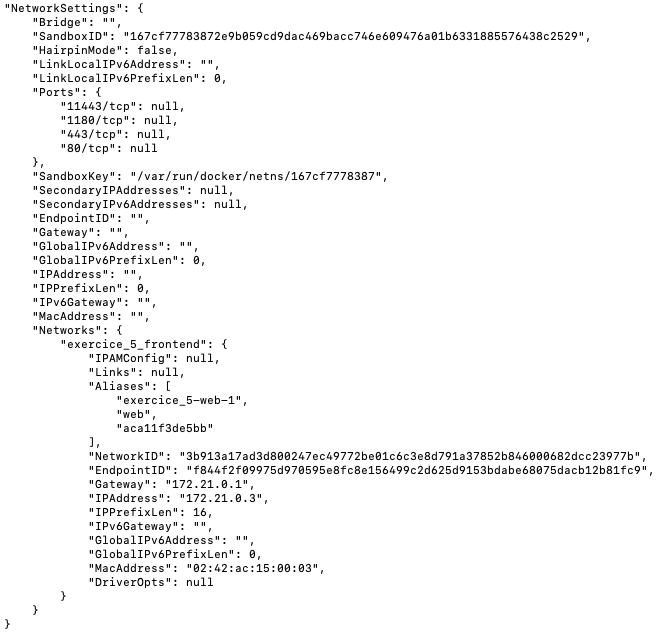

# TP_1 Docker Jonathan Philippe

## Exercice 5

### A 
- Voir [docker-compose](./docker-compose.yml)

### B
- Pour justifier le comportement on peut vérifier que les services n'ont pas le même réseau et qu'ils ne sont pas sur la même IP.

- Service `web`
    - 
    
- Service `db`
    -  

### C 
- Dans une architecture microservices, chaque service peut être exécuté dans un conteneur séparé et communiquer avec les autres services via un réseau dédié. L'isolation réseau peut également être utile pour des raisons de sécurité, pour empêcher un service d'accéder à des données ou des ressources qu'il ne devrait pas avoir accès.

